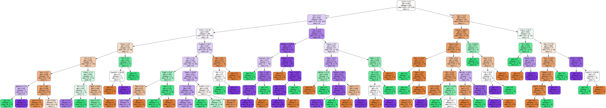
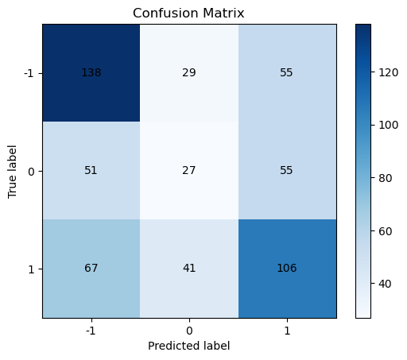
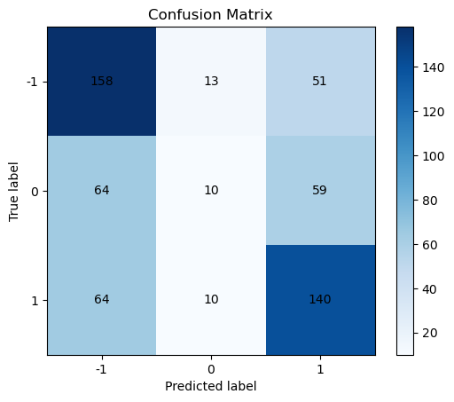
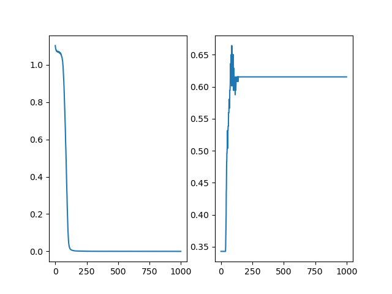

# ML models on Soccer Data - Outcome Prediction

Patton's independent Data Analysis Project

## 1. After_game_Prediction

Predicting the outcome of the game with Statistics of the players / teams in a whole match.

### Models applied:

1. Decision Tree
2. Random Forest
3. Linear Neural Nets

### Data Cleaning:

list of variables dropped:

```
columns_to_drop: [
    "Gls", "gca", "GA", "G/SoT", "G/sh", "CS", "Save%", "Ast", "PassLive", "PassLive.1", "np:G-xG", "G-xG", "npxG/Sh", "xG", "npxG", "PSxG", "PSxG+/-", "xAG", "PassDead", "PassDead.1", "Sh", "SoT", "SoT%"
]
```

These variables were excluded from the analysis as they closely mimic the goal-scoring statistics themselves. Including them would introduce redundancy and could distort the analysis, as they vary in sync with the number of goals.

```
"columns_to_subset_X": [
    "Venue", "Tkl", "TklW", "Def 3rd", "Mid 3rd", "Att 3rd", "Tkl.1", "Att", "Tkl%", "Lost", "Blocks", "Sh", "Pass", "Int", "Tkl+Int", "Clr", "Err", "SCA", "TO", "Sh", "Fld", "Def", "TO.1", "Sh.1", "Fld.1", "Def.1", "SoTA", "Saves", "PKatt", "PKA", "PKsv", "PKm", "Cmp", "Att", "Cmp%", "Att (GK)", "Thr", "Launch%", "AvgLen", "Att.1", "Launch%.1", "AvgLen.1", "Opp", "Stp", "Stp%", "#OPA", "AvgDist", "CrdY", "CrdR", "2CrdY", "Fls", "Fld", "Off", "Crs", "Int", "TklW", "PKwon", "PKcon", "OG", "Recov", "Won", "Lost", "Won%", "Cmp", "Att", "Cmp%", "TotDist", "PrgDist", "Cmp.1", "Att.1", "Cmp%.1", "Cmp.2", "Att.2", "Cmp%.2", "Cmp.3", "Att.3", "Cmp%.3", "xA", "KP", "1/3", "PPA", "CrsPA", "PrgP", "Att", "Live", "Dead", "FK", "TB", "Sw", "Crs", "TI", "CK", "In", "Out", "Str", "Cmp", "Off", "Blocks", "Poss", "Touches", "Def Pen", "Def 3rd", "Mid 3rd", "Att 3rd", "Att Pen", "Live", "Att", "Succ", "Succ%", "Tkld", "Tkld%", "Carries", "TotDist", "PrgDist", "PrgC", "1/3", "CPA", "Mis", "Dis", "Rec", "PrgR", "Dist", "FK", "PK", "PKatt"
]
```

s
These are the columns kept; stored in the `config.json` file. After Examining these variables, I determined that these variables doesn't directly reflect the scores.

## Decision Tree Model:

In this decision Tree, the `Shots on Target`, `Cross`, `Average Distance of Defensive Actions from goal`, `Progressive Carrying Distance` factors seem to apprear at the upper parts of the decision tree.

Applying the soccer domain understandings, I would agree that these parameters indeed seem to reflect the team's chances of winning.

Thus, I wonder if it possible to apply Decision tree as a tool for exploratory analysis, because by checking the gini coefficients, we know how possibly the data could be seperated into 2 categories: that would be something similar to a regression.

### Accuracy: 0.3916083916083916

This model performs just slightly better than random guessing-given there are 3 possible outcomes: Win, Draw, and Lose: probability of random guessing would be 33.33%.

### Graph:



### Confusion Matrix:



In the matrix, -1 represents Lose; 0 represents Draw; 1 represents Win

## Random Forest Model:

### Accuracy: 0.6153846153846154

This model performs significantly better than the decision tree. My personal interpretation is that, given there are too many variables, and some of them might not matter that much. In this case, applying Random Forest helps us to pull out the significant parts of the data.

But it seems that Random Forest doesn't work by pulling out the more important factors, then why can it perform much better than the decision tree???

### Confusion Matrix:



In the matrix, -1 represents Lose; 0 represents Draw; 1 represents Win.

It appears that in the Random Forest, Win / Lose cases are less likely to be mislabeled to the Draw case; while the Draw cases are more likely to be misclassified as Win / Lose.

## Linear Neural Networks:

### Accuracy: 61.54%

### loss & accuracy Graph:



This Black Box Model appears to do a job as good as the Random Forest model. I believe this neural network works by assigning weights in a proper way. I'm not sure if this interpretation is correct.

## 2. In_game_Prediction

How about using the performance of the players in the first 65 minutes to predict the outcome of the game?

### TODO

## Data Sources

This project uses data obtained from the following source:

- Premier League Statistics for the 2022-2023 season, provided by FBref. Available online at: [2022-2023 Premier League Stats](https://fbref.com/en/comps/9/2022-2023/2022-2023-Premier-League-Stats).
